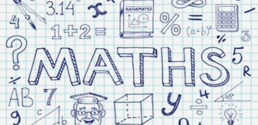
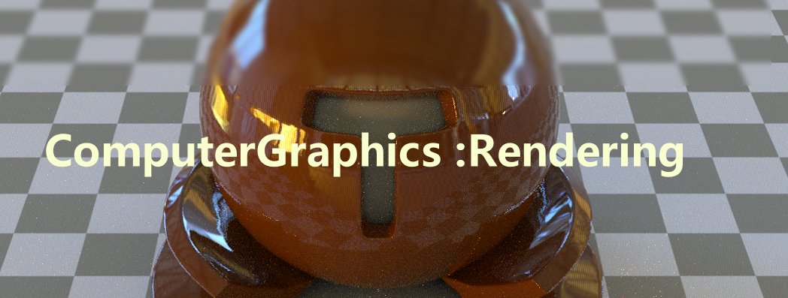
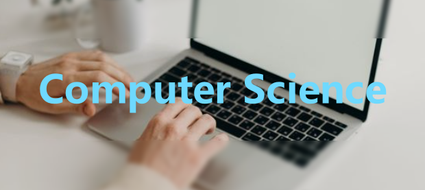

# Personal-Book-Library
这是我个人的读书库，我也会在这里更新读书笔记，涉猎的范围很个人化，包括图形经典书籍，基本计算机组成原理，流体力学，数字信号处理。当然，也会更新一些较为有趣的休闲书籍

## 数学：

### 《托马斯微积分》：

不仅仅微积分，从高中数学开始介绍，直到讲述完整了整个微积分的知识。框架体系严谨，逻辑性完整，适合微积分不扎实的同学观看。地址：

https://pan.baidu.com/s/1jyzYzQNT_tD-51cgk4CFYg?pwd=1562 

### 《线性代数应该这样学》：

线性代数是工科，计算机图形等等重要知识领域的基础，但是其思维与传统的微积分等数值计算不同，需要一定的抽象思维和数学感知能力。因而推荐观看本书，地址：

https://pan.baidu.com/s/1wEP_mbld2EwFWpfcTuyT6g?pwd=1562 

## 图形：

### 渲染：

渲染是计算机图形学的一个子分类，也是很重要的一部分。这里会记录和更新相关的经典书籍。

#### Global illumination（全局光照）：

##### 《全局光照技术：从离线到实时渲染》by秦春林：

介绍全局光照很棒的一本系统性书籍，地址：

[GitHub - ElvisQin/thegibook: 《全局光照技术：从离线到实时渲染》](https://github.com/ElvisQin/thegibook)

## 计算机：

### 计算机组成原理：

### 数据结构与算法：

数据结构与算法，是计算机程序中相当重要的部分，至于这一部分的内容，我个人是先读的《大话数据结构》一书，但是本书对于初学者来说，并不是很友好，这里也推荐b站两位大神的数据结构课程。

《大话数据结构》：https://pan.baidu.com/s/1ZwAe1FFlxtSDcgFYNrfnTw?pwd=1562

《数据结构算法：左程云》：https://www.bilibili.com/video/BV13g41157hK/?spm_id_from=333.337.search-card.all.click

《数据结构算法：韩顺平》：[尚硅谷、韩顺平java数据结构与算法_哔哩哔哩_bilibili](https://www.bilibili.com/video/BV1Xo4y1Z7RR/?spm_id_from=333.337.search-card.all.click&vd_source=c0f37e8058f4fdd29336bf2546908230)

#### 读书笔记：

## 美学：
